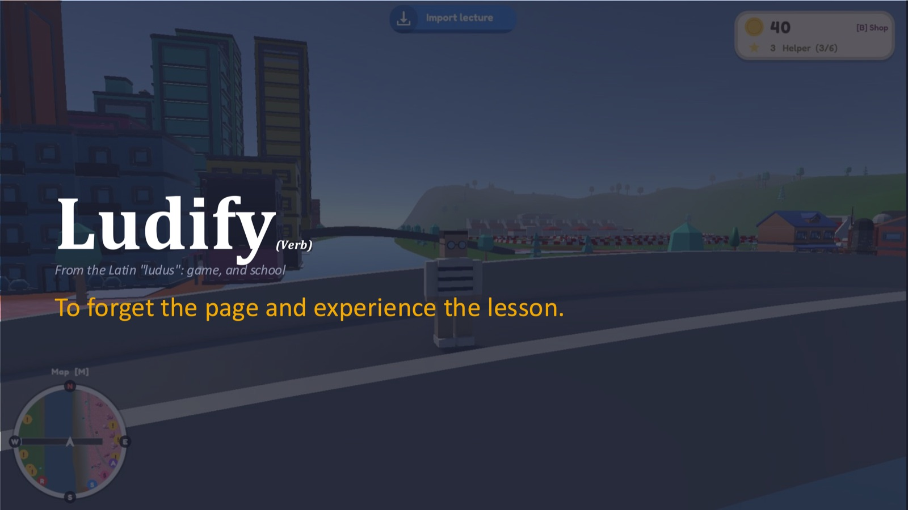
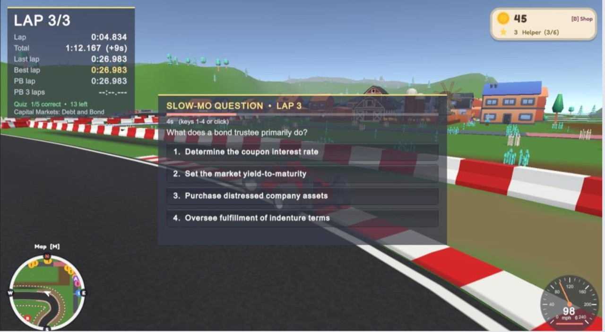
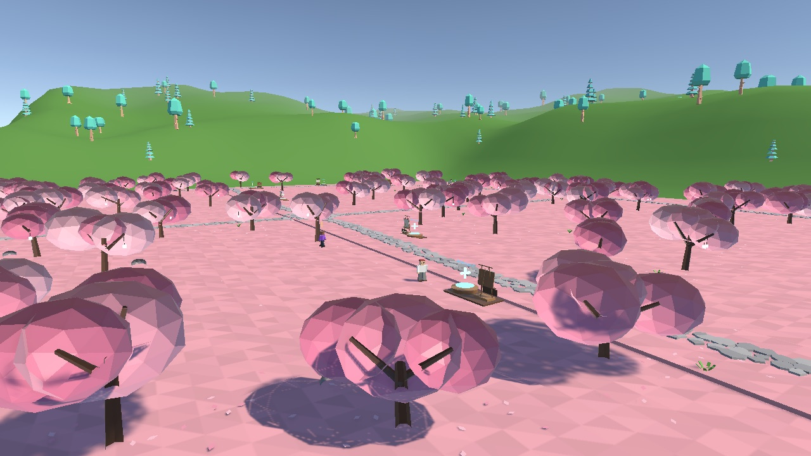
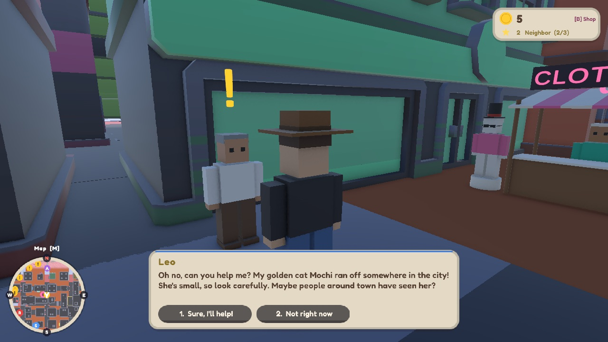
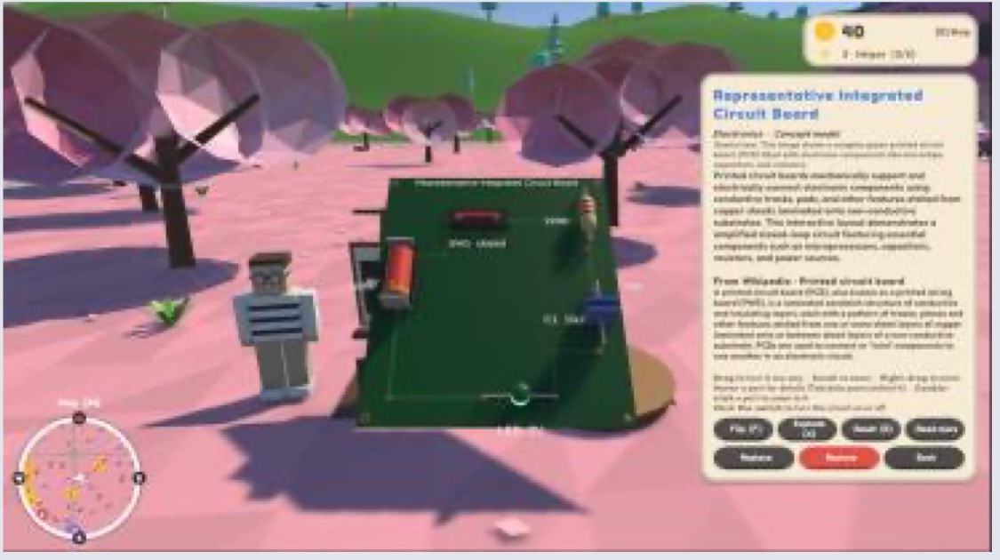
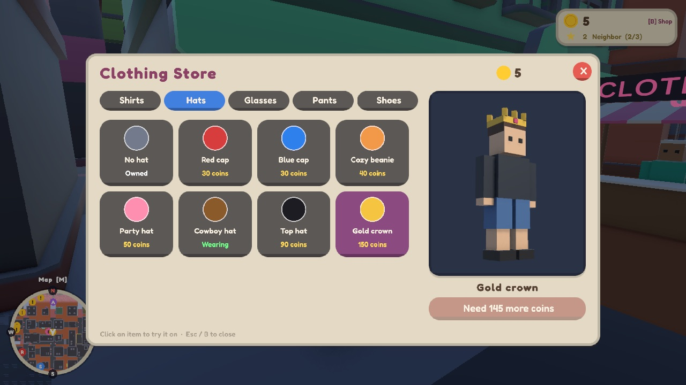
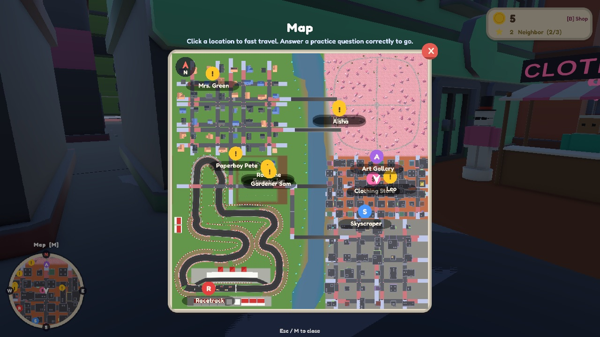
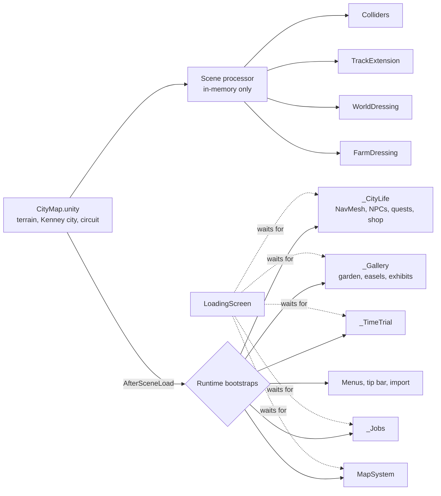
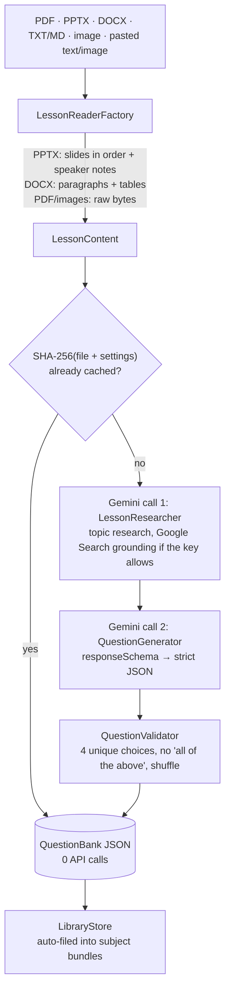

<p align="center">
  
</p>

<h1 align="center">Ludify <sub><i>(verb)</i></sub></h1>

<p align="center">
  <i>From the Latin <b>"ludus"</b>: game, and school.</i><br>
  <b>To forget the page and experience the lesson.</b>
</p>

<p align="center">
  Unity 6 (6000.6.3f1) · URP · C# · Google Gemini API · macOS &amp; Windows
</p>

---

Ludify turns a teacher's **own** class material into a playable, low-poly 3D world. Drop in a lecture PDF, a
slide deck, a lesson plan or a screenshot. Gemini reads it and writes practice questions, and the game weaves those
questions into everything you do:
- racing a Formula-style car;
- helping city residents find a lost cat;
- mowing a lawn on a farm job;
- fast-travelling across the map.

Drop in a diagram instead and it becomes a **working 3D exhibit** in a cherry-blossom art gallery. A hand-drawn circuit
becomes a circuit board with a live electrical simulation you can take apart.

The same engine handles simple subjects and complex ones: **from fractions to circuits, K-12 through college.**

| | |
|---|---|
|  **Knowledge Time Trial.** The race slows down for a question generated from an imported document (curriculum, lecture slides, lesson plan). |  **Art gallery.** Stone paths, cherry blossoms and easels. Every canvas can turn an image into a 3D exhibit. |
|  **Quests.** Residents ask for help, and the hints cost a correct answer. |  **Hands-on exhibits.** A pasted image becomes a working 3D circuit. |
|  **Clothing store.** Spend the coins you earn by learning. |  **Map and fast travel.** Every destination is gated by a practice question. |

---

## Contents

- [Why Ludify](#why-ludify)
- [Features](#features)
- [Controls](#controls)
- [How it works (the code)](#how-it-works-the-code)
  - [Architecture: everything installs itself at runtime](#architecture-everything-installs-itself-at-runtime)
  - [Import: class files → practice questions](#import-class-files--practice-questions)
  - [Questions API: one deck, every game](#questions-api-one-deck-every-game)
  - [Images → hands-on 3D exhibits](#images--hands-on-3d-exhibits)
  - [The art gallery](#the-art-gallery)
  - [City Life: residents, quests and hints](#city-life-residents-quests-and-hints)
  - [Knowledge Time Trial](#knowledge-time-trial)
  - [Jobs, coins, stars and the clothing store](#jobs-coins-stars-and-the-clothing-store)
  - [World, map, UI and loading](#world-map-ui-and-loading)
  - [What gets saved](#what-gets-saved)
- [Project structure](#project-structure)
- [Getting started](#getting-started)
- [Business model](#business-model)
- [Roadmap](#roadmap)
- [Team](#team)
- [Credits](#credits)

---

## Why Ludify

**Built for the classroom from day one, not a game adapted to it.**

Most "educational games" either ship fixed content (a pre-made world about one topic) or ask the teacher to become a
game developer first. Ludify goes the other way: the teacher brings the lesson and the game is already built.
Every upload produces new questions and new exhibits, so the world adapts to whatever is being taught this week.

| | **Ludify** | Roblox | Minecraft Education |
|---|---|---|---|
| **Content** | Built from the teacher's own files | You build the game first | Pre-made worlds and lessons |
| **Adapts to the lesson** | Yes, on every upload | No | Limited, content is fixed |
| **Teacher control** | Teacher sets content and mode | Low | Moderate |
| **Distractions** | Learning-only world | High, open platform | Moderate |
| **Teacher perception** | Built for school | Seen as a game | Some see it as "just Minecraft" |

Minecraft Education has a free marketplace and wide reach. We see it as a supplement, not a replacement: it offers
fixed content, and we offer variety.

**From fractions to circuits, with one engine.**
- **K-12:** fractions and arithmetic games, vocabulary and reading review, state-test and unit prep. These are simple
  concepts with lots of repetition, and the minigames (racing, quests, jobs) handle that practice.
- **College:** engineering circuits with a live simulation, cell biology as 3D structures, and any dense syllabus a
  professor uploads. These are complex systems, and galleries turn their diagrams into 3D exhibits students can walk around.

**Test with students, then deploy to teachers.** Every feature follows *Build → Test at the university → Refine →
Deploy to K-12*. The university is our live test bed, in the spirit of the **Wisconsin Idea**. Badgers use Ludify in
real classes and help improve it, so K-12 teachers only see features that already work in a classroom.

**Our moat**
- **Adaptive by design.** Every world is generated from the teacher's own material. Competitors would have to
  rebuild their content model to match.
- **The game already exists.** Racing, quests, jobs, galleries and a full world are built. On Roblox a teacher would
  have to build all of that first.
- **Marketplace network effect.** More teachers selling plans brings more buyers, which brings more sellers.
- **Learning data.** Anonymized data on which questions and formats work, across K-12 and college, improves every new lesson.

---

## Features

### 📚 Import your class material
- **Any common format:** PDF, PowerPoint (`.pptx`, including speaker notes), Word (`.docx`, including tables), text
  and Markdown, and images (PNG/JPG). Scanned PDFs and slide screenshots work too, because Gemini reads them natively.
- **Paste anything:** paste lecture text, or paste an image straight from the clipboard. That covers Snipping Tool,
  screenshots, "Copy image" in a browser, image links and copied image files.
- **Library and subject bundles:** every import is kept and automatically filed under the subject Gemini detects
  (Science, Math, History, Language, Geography, CS, Art, Music). You can drag items between bundles, reorder them and
  generate one question set per bundle. The **current bundle** sets both the questions every game uses and the UI's
  color theme.
- **Cheap and repeatable:** 2 Gemini calls per new file. Re-importing the same file costs nothing (it's cached).

### 🏎️ Knowledge Time Trial (racing)
- Get into any grid car on the F1-style circuit (**X**) to start a **3- or 5-lap time trial** with a 3-2-1 countdown.
- **Two questions per lap**, at random points. The game drops into **slow motion (10%)**, and you have 15 real seconds
  to answer:
  - right: a **speed boost** and **+5 coins**;
  - wrong: a slowdown and a **+3 s penalty**.
- **Questions are never reused.** Every asked question is remembered per lecture. When a lecture runs out, the
  game prompts for a new import.
- A live HUD shows lap, total, last, best, personal bests and quiz score. Best lap and best total are saved overall
  and per lecture. Checkpoints stop shortcuts, and a "wrong way" warning shows if you turn around.
- The circuit has a banked 180° hairpin, a chicane, a catch wall and trackside sponsor boards. Cars are physically
  simulated, with a 6-speed gearbox and recorded V8 engine audio.

### 🏙️ City Life: residents and quests
- **16 residents** walk the city streets. Each one is cloned from the player's blocky look with a random outfit and a name.
- Quest-givers show a yellow **!** and ask for help:
  - **find my lost cat or dog**: follow a paw-print trail and listen for a 3D "meow" or "woof";
  - **find my lost keys, phone, backpack or teddy**: it sparkles when you're close;
  - **collect 5 blown-away pages**;
  - **deliver a parcel** to another resident.
- **Hints cost a correct answer.** Residents with a blue **?** ask a practice question first. Each hint gets more
  precise:
  1. the area of the city;
  2. a landmark building, named in its own color, with a light pillar marking it;
  3. a compass direction and distance.

  Each hint also draws a **shrinking search circle** on the minimap.
- Rewards are **coins plus a helper star**, and stars earn titles: Newcomer → Neighbor → Helper → Local Hero → City Legend.

### 🌾 Suburb and farm jobs
Five job-givers each run a minigame, with questions built in:

| Job | Giver | How it works | Reward |
|---|---|---|---|
| Newspaper route | Paperboy Pete | Deliver papers **by bike**; every household asks a question first | 35 coins, +10 if you're fast |
| Lawn mowing | Mrs. Green | Mow the lawn; the mower stalls at 25%, 50% and 75% until you answer | 30 coins |
| Harvest | Farmer Joe | Pick 12 crop rows | 35 coins |
| Raking leaves | Rosa | Rake and bag 40 piles | 30 coins |
| Planting | Gardener Sam | Plant, water and harvest | 40 coins |

### 🎨 Art gallery and hands-on 3D exhibits
- A **cherry-blossom park**: pink ground, a stone path through the whole gallery, about 95 low-poly cherry trees with
  glowing lanterns, and 16 wooden **easels**.
- Walk up to an easel and press **I** (or **Ctrl+V** to paste). Gemini looks at the image, the **canvas shows your picture**,
  and a **3D model of it** is built on the platform beside the easel. Each exhibit gets its own explanation card.
- **Build modes:**
  - **Concept:** Gemini builds the best teaching model of what the image shows. A schematic becomes a colored,
    working circuit board; a photo becomes its underlying concept.
  - **Traced:** copies exactly what's drawn.
  - **Compare:** builds both, side by side.
- **Hands-on viewer (I):** drag to spin, scroll to zoom, **F** flip, **X** explode, **R** reset, double-click to zoom
  to a part. Hover any part for what it is, including live voltages and currents. A **Wikipedia** summary is added
  automatically.
- **Kits:**
  - **circuits:** a two-sided PCB with a real DC simulation, where bulbs light by power and switches can be clicked;
  - **molecules**, in CPK colors;
  - **solar systems**, with Kepler-speed orbits;
  - **cells**, with see-through membranes;
  - **gears**, turning at the right ratios;
  - **3D bar charts**;
  - **geometry**, with measurement lines;
  - **processes** such as food chains and cycles, with flowing particles.

### 👕 Clothing store, coins and titles
- About 35 items: shirts (including stripes), hats (caps, beanie, cowboy, top hat, party hat, gold crown), glasses
  (round, sunglasses, 3D, star), pants and shorts, and shoes and sneakers.
- Try things on with a **live preview**, then buy with the coins you earn from quests, jobs and correct race answers.
  Your outfit is saved.
- Open it at Stella's stall downtown (**E**) or anywhere with **B**.

### 🗺️ Map, fast travel and navigation
- A circular, north-up **minimap** with N/E/S/W on its rim. Press **M** (or click it) for the **full map**, which is a
  live top-down render of the world.
- **Fast travel** to the racetrack, the skyscraper, the art gallery, the clothing store, or any quest giver, each marked
  live on the map. Every trip asks a practice question first.

### ✨ Always on screen
- The **tip bar** says what you can do where you are.
- The **coin wallet** shows your stars and title.
- The **quest tracker** shows the live search direction.
- A **themed UI**: cream panels, pill buttons, the Fredoka font and procedurally drawn subject icons.
- The **Esc menu** has Import files, Organize subjects, Settings and Help.
- A **loading screen** waits until every system is ready.

---

## Controls

| Action | Key |
|---|---|
| Move / sprint | **WASD** / **Shift** |
| Look / zoom | Click-drag or two-finger swipe / **Ctrl** or **Cmd** + scroll, or **+/-** |
| Turn / tilt camera | **Q/E** · **R/F** |
| Talk, pick up, interact | **E** |
| Get in / out of a car | **X** (drive with **WASD**, **Space** = handbrake) |
| Answer a question | **1–4** or click |
| Map | **M** |
| Clothing store | **B** |
| Add or inspect an exhibit at an easel | **I** (paste: **Ctrl+V**) |
| Menu | **Esc**, or the ☰ Menu button |

---

## How it works (the code)

### Architecture: everything installs itself at runtime

Ludify is one Unity scene (`Assets/Scenes/CityMap.unity`), but almost nothing gameplay-related is saved in it.
**Every system builds itself when the scene loads.** This is the pattern that holds the whole project together:

```csharp
[RuntimeInitializeOnLoadMethod(RuntimeInitializeLoadType.AfterSceneLoad)]
static void SetUpLoadedScenes()
{
    for (int i = 0; i < SceneManager.sceneCount; i++) SetUp(SceneManager.GetSceneAt(i));
}
// SetUp is idempotent: it checks for its own root object ("_CityLife", "_Gallery", …) and returns if it exists.
```

World changes that have to exist before physics and static batching run go through an Editor scene processor
(`Scripts/Editor/WorldCollidersSceneProcessor.cs`), which edits **the in-memory copy** of the scene on Play and in
builds. That covers colliders, the extended race track, the arched bridges, the farm and the hills. The saved `.unity`
file never changes.



**Why this is practical:**
- **Three people, one scene, zero scene merge conflicts.** Unity scene files are notoriously hard to merge. Because
  each teammate's features live in code under their own folder, everyone can work on the same world at the same time.
- **Works identically in the Editor and in builds.** Teachers use the built game, not Unity.
- **Systems talk through small public APIs**, not scene references. For example: `QuestionPool.Deck`,
  `QuestionPrompt.AskAsync`, `MapMarkers.Add`, `PlayerProgress.AddCoins`, `NpcFactory.Create`,
  `ImportButtonOverlay.LessonImported`. Features can be added or removed without touching each other.
- **Almost no art assets are needed.** Icons, sprites, the star, the paw prints, textures, the meow and woof sounds,
  the cherry trees and the easels are all generated in code. The only imported art is the Kenney/Quaternius low-poly
  packs and one engine recording.

### Import: class files → practice questions

`Assets/Ludify/Import/`, namespace `Ludify.Import`.



- **Readers** (`Readers/`) turn each format into plain `LessonContent`. PowerPoint and Word files are just zipped XML,
  so `OpenXml.cs` reads them directly with no Office install and no native plugins. PDFs and images are sent to Gemini
  as attachments (`inline_data`), so scanned pages and screenshots work.
- **Two focused Gemini calls** (`Llm/GeminiClient.cs`, plain `UnityWebRequest` against the REST API):
  1. **Research** the topic, to catch what the slides leave implicit. This uses Google Search grounding when the key
     has quota, and otherwise falls back automatically to the model's own knowledge.
  2. **Generate questions** with a `responseSchema`, so the answer is always valid JSON.

  Prompts pin the format:
  - questions ≤ 120 characters and choices ≤ 40, so they fit a racing HUD;
  - difficulty split 40% recall, 40% understanding, 20% application;
  - a one-sentence explanation per question.
- **Validation:** `QuestionValidator` rejects bad questions (duplicate choices, "all/none of the above", too long) and
  shuffles the answer positions.
- **Retries:** `SendWithRetryAsync` retries transient 5xx and rate-limit errors with back-off, but not daily-quota errors.
- **Caching:** each bank is keyed by `SHA-256(file bytes + pipeline version + model + settings)` and saved under
  `persistentDataPath/QuestionBanks/`. Re-importing the same file is instant and free. Bumping `PipelineVersion`
  invalidates old banks when the prompts change.
- **Keys never ship in the game.** They're read from the `GEMINI_API_KEY` environment variable or a gitignored
  `ludify_secrets.json`.

**Why this is practical for teachers:**
- It runs **inside the built game on the teacher's own laptop**. There's no server to host, no Python and no Office.
- It's **cheap**: under $0.05 to turn a lesson into a question bank at Gemini Flash-Lite prices, and free on the free
  tier. Repeat imports cost nothing.
- Teachers upload **what they already have** (last year's slides, a PDF chapter, a phone photo of the whiteboard),
  not a special format.

### Questions API: one deck, every game

Every game asks questions through the same few calls, so a new minigame gets the teacher's content for free:

```csharp
// Ask a question as a gate (fast travel, quest hints, jobs): keeps asking until it's answered right or cancelled.
QuestionResult r = await QuestionPrompt.AskAsync("Answer to get Maria's hint", "Get hint");
// Correct · Cancelled · NoQuestions (no lecture yet: the caller decides the fallback, usually "free")

// Or draw questions yourself (the race HUD does this):
McQuestion q = QuestionPool.Deck.Next();
bool right = QuestionPool.Deck.RecordAnswer(q, chosenIndex);   // missed questions come back later
```

- `QuestionPool.Deck` is one shared `QuestionDeck` over the **current subject bundle**, so different games don't
  repeat each other's questions.
- The time trial also records every question it asks per lecture (`UsedQuestions`), so **a race never asks the same
  question twice**, even across sessions.

### Images → hands-on 3D exhibits

An image becomes a model through **one** Gemini vision call. Nothing is generated as a mesh by an AI model: Gemini
returns a **structured description**, and Unity builds the model from procedural parts.

```
image ─► ImageModelGenerator (1 Gemini call, responseSchema, cached by image hash + mode)
      ─► SceneModel { title, subject, explanation, kit,
                      parts[{kind, x,y,z, size, color, label, value, info}],
                      links[{from, to, kind: wire | bond | arrow | mesh …}] }
      ─► LayoutRelaxer  (per kit: spring layout for circuits, teeth that touch for gears,
                         organelles kept inside the membrane, evenly spaced orbits…)
      ─► ModelBuilder + PartLibrary + LinkBuilder / PcbBuilder ─► GameObject with ExhibitPart info
```

- **Circuits are real.**
  - `CircuitNetlist` turns the wires into nodes.
  - `CircuitSolver` runs **DC nodal analysis**, solving the node voltages and branch currents.
  - `CircuitSim` drives the model from those numbers: bulbs glow by power, current dots move by current, and
    clicking a switch re-solves the circuit.
- **Other kits animate from physics-like rules:** `Orbiter` uses Kepler-speed orbits, `GearTrain` uses tooth
  ratios, and process arrows get particle flow.
- **Why this is practical:** it needs no GPU, no paid 3D-generation service and no waiting minutes for a mesh. The
  result is **clean, labeled and interactive**, where an AI mesh would be a lump of triangles. It costs one cheap
  call per image, and it's cached.

### The art gallery

`Assets/Ludify/Gallery/`
- **`GalleryArea` + `GalleryGarden`** turn the north-east city blocks into the park at runtime:
  - buildings and roads inside the area are switched off, and a long road passing through is covered;
  - the ground is painted pink on an **in-memory copy of the terrain** (a new terrain layer), so the saved terrain
    asset is never modified;
  - the stone path is a smoothed Catmull-Rom network (a spine, a loop, a cross path, a plaza, and links to the
    bridges) paved with irregular low-poly slabs.
- **Trees, stones, petals, rocks and ferns** are placed with seeded spacing (so the layout is the same every run), then
  **merged into about 16 meshes, one per color**. Hundreds of objects become a handful of draw calls.
- **Easels:** `Pedestal` (easel + model platform) shows the image on the canvas and the model beside it.
- **`GallerySystem`** handles interaction (I / Ctrl+V), `ExhibitViewer` is the hands-on camera, and `ExhibitStore`
  saves exhibits so they reload **without API calls**.

### City Life: residents, quests and hints

`Assets/Scripts/City/`
- **`CityNav`** builds a NavMesh at runtime over the east bank:
  - Recast only sees the *faces* of a box collider, which would leave walkable floors inside buildings and on roofs,
    so every building volume is blocked out with a `NavMeshModifierVolume`;
  - valid points must be at ground level and connected to a "hub" on the main street network;
  - so NPCs, lost pets and items **always end up outside on the streets**.
- **`NpcFactory`** clones the player's `VisualRoot`, re-colors it by body-part name and adds a `NavMeshAgent`. The same
  factory is reused for the shopkeeper and the farm job-givers.
- **`QuestManager`** generates quests from templates, places targets 40–120 m away beside a building, and turns the
  target's **real position** into hints:
  - `CityArea.DescribeArea`: "up north near the Suspension Bridge";
  - the nearest colored building from `CityColorizer`: "the lavender (light purple) building";
  - `CityArea.DescribeDirection`: "north-east of you, about 70 m".
- **`CityColorizer`** gives every building one of 10 hue-shifted copies of the Kenney texture atlas, seeded by position
  so no two neighbors match. This makes "the pink building" a usable landmark.
- **Paw prints** follow the actual NavMesh path the pet took. **The pet follows you** on its own `NavMeshAgent` and
  hides while you drive. The **meow and woof** are synthesized sine harmonics (`AudioClip.Create`) played as 3D sound,
  so you can hear the cat from about 35 m and home in on it.
- **`MapMarkers`** is a small registry the map draws from. Quest-givers, hint NPCs, search circles, the shop and the
  gallery all register markers, and markers can follow moving NPCs.

### Knowledge Time Trial

`Assets/Scripts/TimeTrial/`
- `TrackPath` is the circuit's centreline (2 m apart, 987 m per lap). Lap progress and checkpoints use the nearest
  point on it, which also catches wrong-way driving.
- Two question triggers are placed at random in each half of the lap. A question sets `Time.timeScale = 0.1` (with
  matching fixed timestep), and the answer timer runs on unscaled time.
- `CarController.ApplyBoost` / `ApplyPenalty` change the drive force for a few seconds.
  `VehicleInteraction.BlockExit` stops you jumping out mid-question.
- Records and used questions are saved as JSON per lecture.

### Jobs, coins, stars and the clothing store

- **Jobs** (`Assets/Scripts/Jobs/`) share a `Job` base class and a `JobManager`, and are built on the City Life
  patterns (NPC factory, dialogue, map markers, question gate). The bike is an arcade `CharacterController` with a
  pedalling rider copied from the player.
- **`PlayerProgress`** is one JSON file holding coins, stars, completed quests, owned items and the equipped outfit.
  It raises a `Changed` event, and the HUD animates from that.
- **`Wardrobe`** adds low-poly accessories (`Accessory_<slot>_*`) to the player's model and restores original
  materials and shapes per slot.
- **`StoreView`** draws its live preview by putting the character on a spare layer that only the preview camera
  renders. That gives a clean background without a second copy of the character.

### World, map, UI and loading

- **The world** is a hand-planned city, suburbs, farm, river and F1 circuit, built from the Kenney City/Racing kits on
  a painted terrain.
  - `WorldDressing` adds arched walkable bridges, hills with about 260 trees, and map boundaries.
  - `TrackExtension` rebuilds the circuit with a banked hairpin as one mesh.
  - `FarmDressing` adds the barnyard and crop fields.
  - `FallGuard` puts anything that falls out of the world back at spawn.
- **Map** (`Assets/Ludify/Map/`): the map image is a **live top-down render of the scene**, not a drawn texture, so it
  can never go out of date. `FastTravel` finds a safe standing spot with capsule overlap checks.
- **UI** is built entirely in code with `UiKit` (uGUI helpers), styled by `LudifyTheme` and `ThemedGraphic`, with
  subject palettes and icons drawn procedurally. Every screen, including teammates' screens, re-themes automatically
  when the subject bundle changes.
- **`LoadingScreen`** shows a checklist and holds the player until every runtime system reports ready:

  > Shaping the world → Laying the race track → Planting the farm → Parking the race cars → Waking up the city →
  > Hiring farm & suburb workers → Opening the art gallery → Drawing the map

### What gets saved

Everything is saved under Unity's `Application.persistentDataPath`. That's per-user, works on Mac and Windows, and is
never inside the repo.

| Folder / file | What |
|---|---|
| `QuestionBanks/<hash>.json` | Generated question banks (the import cache) |
| `Library/` | Imported files and subject bundles |
| `ImageModels/<hash>.json` | Cached image → 3D model descriptions |
| `Gallery/exhibits.json` + `images/` | Placed exhibits (reload without API calls) |
| `TimeTrials/records.json`, `used_questions.json` | Race records; questions already asked |
| `Progress/player_progress.json` | Coins, stars, quests, owned clothes, outfit |

---

## Project structure

```
Assets/
├── Scenes/CityMap.unity          The world (terrain, city, suburbs, farm, river, circuit)
├── Scripts/                      Gameplay
│   ├── PlayerController, OrbitCamera, CarController, CarEngineAudio, Speedometer, VehicleInteraction
│   ├── RuntimeWorldColliders, WorldDressing, TrackExtension, FarmDressing, FallGuard, LoadingScreen
│   ├── Editor/WorldCollidersSceneProcessor.cs   In-memory scene setup on Play / build
│   ├── City/        City Life: CityNav, NpcFactory, Npc, QuestManager, QuestTemplates, QuestTargets,
│   │                CityColorizer, CityHud, DialogueBox, PlayerProgress, Wardrobe, StoreView, ClothingShop
│   ├── TimeTrial/   TimeTrialManager, TimeTrialHud, TrackPath, TimeTrialRecords, UsedQuestions
│   └── Jobs/        JobManager, Job, NewspaperJob, LawnMowingJob, HarvestJob, RakeLeavesJob, PlantingJob, BikeController
├── Ludify/
│   ├── Import/      Class files → questions, images → 3D (namespace Ludify.Import)
│   │   ├── Readers/     PDF, PPTX, DOCX, text, image readers (OpenXml without Office)
│   │   ├── Llm/         GeminiClient, LlmConfig, WikipediaClient
│   │   ├── Pipeline/    LessonImporter, LessonResearcher, QuestionGenerator, QuestionValidator, ImageModelGenerator
│   │   ├── Building/    ModelBuilder, PartLibrary, PcbBuilder, CircuitSolver, CircuitSim, LayoutRelaxer, …
│   │   ├── Api/ Storage/ Library/ Clipboard/ Model/
│   │   └── UI/          UiKit, QuestionPrompt, ImportPanel, Theme/
│   ├── Gallery/     GallerySystem, GalleryArea, GalleryGarden, Pedestal (easel), ExhibitViewer, ExhibitStore
│   ├── Map/         MapSystem, MinimapView, FullMapView, MapSnapshot, FastTravel, MapMarkers
│   └── Menu/        PauseMenu, SettingsScreen, SubjectsScreen, TipBar
├── Kenney/ Quaternius/ Audio/ Terrain/   Art and audio (see Credits)
docs/import-pipeline.md             Detailed import and exhibit design
HANDOFF.md                          Team log of every change
CLAUDE.md                           Project rules and folder ownership
```

About 20,000 lines of C#.

---

## Getting started

1. **Install Unity 6000.6.3f1** exactly (everyone on the team uses the same version), with Mac and/or Windows build support.
2. **Clone** this repo and open the folder in Unity Hub.
3. **Get a free Gemini API key** at <https://aistudio.google.com> → *Get API key* (no credit card needed). Then either:
   - copy `ludify_secrets.example.json` to `ludify_secrets.json` in the project root and paste the key into
     `geminiApiKey` (this file is gitignored, so **never commit it**), or
   - set a `GEMINI_API_KEY` environment variable.

   In Unity, **Ludify → Import → Check Gemini Setup** confirms the key works.
4. Open **`Assets/Scenes/CityMap.unity`** and press **Play**. Import a lecture from **Esc → Import files**, then get in
   a car, talk to a resident or visit the gallery.
5. To build: **File → Build Profiles →** macOS or Windows. Everything is set up at runtime, so builds behave exactly
   like the Editor.

> **Privacy:** on Gemini's free tier, Google may use prompts to improve its products. Don't import files that contain
> private student data.

---

## Business model

**Free with ads, or go Pro.** Pro is priced above our AI cost, which stays low because every lesson is cached.

| Free (ad-supported) | Pro (subscription, pricing to be set) |
|---|---|
| Standard AI model and upload limits | **Better AI model** (e.g. Gemini 3.5 Flash) for sharper questions |
| Ads on billboards around the race track and city, between questions, and before the loading screen (web) | **Ad-free:** no interruptions during play |
| | **More upload bandwidth:** bigger files, more lessons per month |

- **The ad space is already built.** Trackside sponsor boards are in the game today, with placeholder brands such as
  Orbitron Energy and Pixel Cola.
- **Current AI cost estimate:** under **$0.05** to turn one lesson into a question bank, at Gemini Flash-Lite list prices.

**Teacher marketplace.** Teachers upload their lessons and tune the questions in Ludify, then list the optimized plan.
Other teachers and schools buy ready-to-play units with no prep, the teacher gets paid, and Ludify takes a cut. Ludify
also publishes its own optimized curricula. Every plan sold makes the platform more valuable to the next teacher.

**Long term: a natural acquisition target.**
- Ludify is already built on **Google's Gemini API**, so it fits Google's stack with little rework.
- A teacher marketplace and school accounts complement Google's existing classroom tools.
- Anonymized, aggregate insight into how students learn, from K-12 through college, gathered within privacy law.
- Other likely buyers are education platforms adding AI-generated content, curriculum and textbook publishers, and
  game companies expanding into education.

*Our focus now is building value, not selling.*

---

## Roadmap

- **Multiplayer:** co-op play, and class-wide races and challenges.
- **Teacher and student mode:** only teachers upload files, and students play in a controlled world. This replaces
  today's developer mode.
- **Platforms:** Mac and Windows **today**; Web, ChromeOS and Android **next**; VR and AR **later**.
- **Creator tools:** teachers and students build their own minigames to sell or list for free.

---

## Team

| Area | Owner |
|---|---|
| Gameplay: world and map building, character, Knowledge Time Trial, City Life (NPCs, quests, hints), clothing store, cherry-blossom gallery grounds | **Musa Rahman** ([@musarahman06](https://github.com/musarahman06)) |
| Import pipeline (files → questions), images → 3D exhibits and hands-on viewer, art gallery system, minimap/fast travel, themed UI, Esc menu, subject library, tip bar | **BenJPanackal** |
| Cars and driving physics, engine audio, performance, camera controls, world dressing (bridges, hills), extended circuit, farm, suburb and farm jobs, loading screen | **therishonsingh** |

Every change is logged in [`HANDOFF.md`](HANDOFF.md). Folder ownership and team rules are in [`CLAUDE.md`](CLAUDE.md).

---

## Credits

- **3D art:** [Kenney](https://kenney.nl) City Kit (Commercial, Suburban, Roads) and Racing Kit (CC0).
  [Quaternius](https://quaternius.com) LowPoly Farm Buildings (CC0).
- **Engine sound:** "Generic V8 Engine Sound" by DerMeehdrescher (Meehdrescher Studios), **CC-BY-SA 4.0**
  ([OpenGameArt](https://opengameart.org/content/generic-v8-engine-sound)). See `Assets/Audio/CREDITS.md`.
- **Font:** Fredoka by the Fredoka Project Authors, SIL Open Font License (`Assets/Ludify/Import/Resources/Fonts/OFL.txt`).
- **Runtime file picker:** [UnitySimpleFileBrowser](https://github.com/yasirkula/UnitySimpleFileBrowser) by yasirkula.
- **AI:** [Google Gemini API](https://ai.google.dev). **Facts:** the Wikipedia REST API.
- Built with **Unity 6** and the Universal Render Pipeline.
